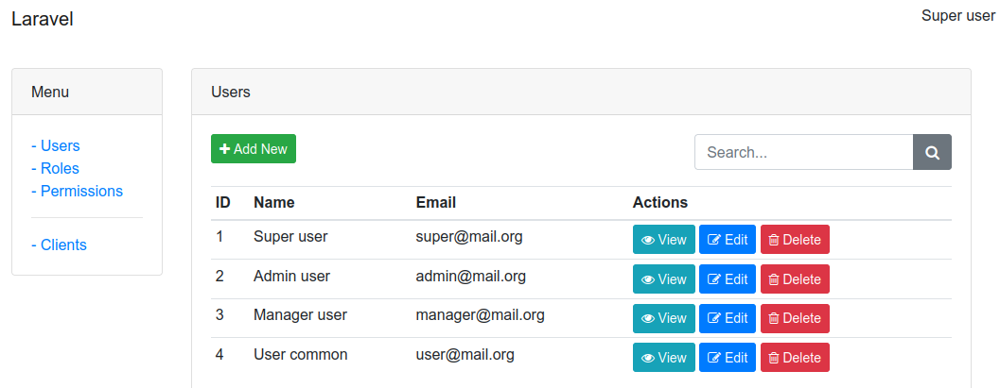
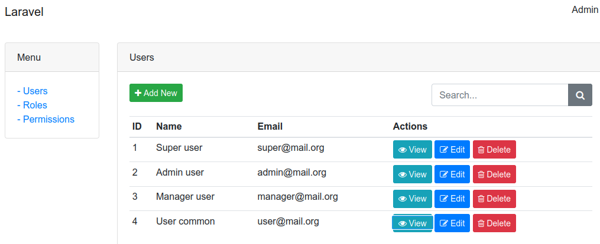
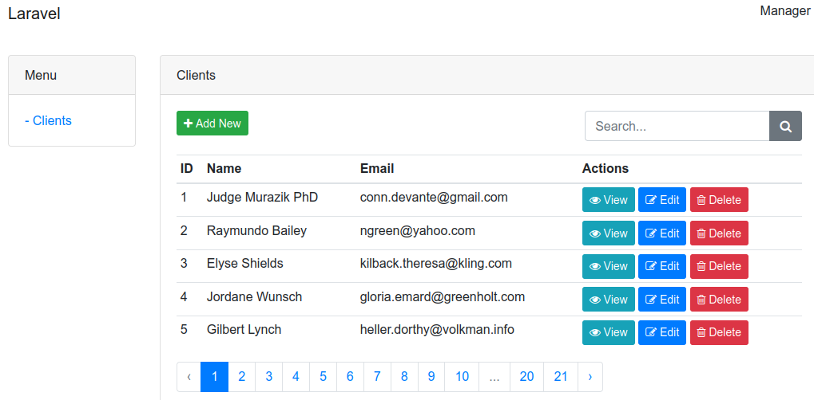
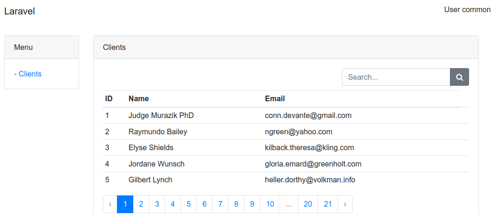

# ACL em aplicativo laravel 8

Uma implementação inteiramente com recursos nativos. Sem uso de nenhum pacote.
Usando trait, seeder, provision, middleware, entre outros recursos.

Download

Inicialmente com:

4 roles: 
- super
- admin
- manager
- user

Cada role tem seu conjunto de permissões

Super tem permissão total sobre tudo no aplicativo.
Admin - permissão total sobre todos os users, as roles e as permissions
Manager - permissão total sobre os CRUDs de negócios, no caso clients
User - permissão somente sobre o index de clients

Os usuários pertencem a uma role cada um. Cada user terá todas as permissões da role. Caso precise de permissões diferentes precisará criar outra role

## Customizações

Você pode customizar para atender suas necessidades sem grandes dificuldades.

## Instalar e executar

- Crie um banco e configure em .env

- composer install

- npm install

- npm run build

php artisan migrate --seed

php artisan serve

http://127.0.0.1:8000/login

Acessar com um dos users:

super@mail.org
123456

admin@mail.org
123456

manager@mail.org
123456

user@mail.org
123456

## Veja algumas telas

Cada user verá apenas os itens a que tem direito.

Super

Admin

Manager

User

 

## Executando

- Efetuar o download

- Descompactar e acessar a pasta

- composer install

- Criar o banco

- Configurar mo .env

- Executar

php artisan migrate --seed

php artisan serve

http://127.0.0.1:8000/login

Entre com um dos users

super@mail.org e 123456

